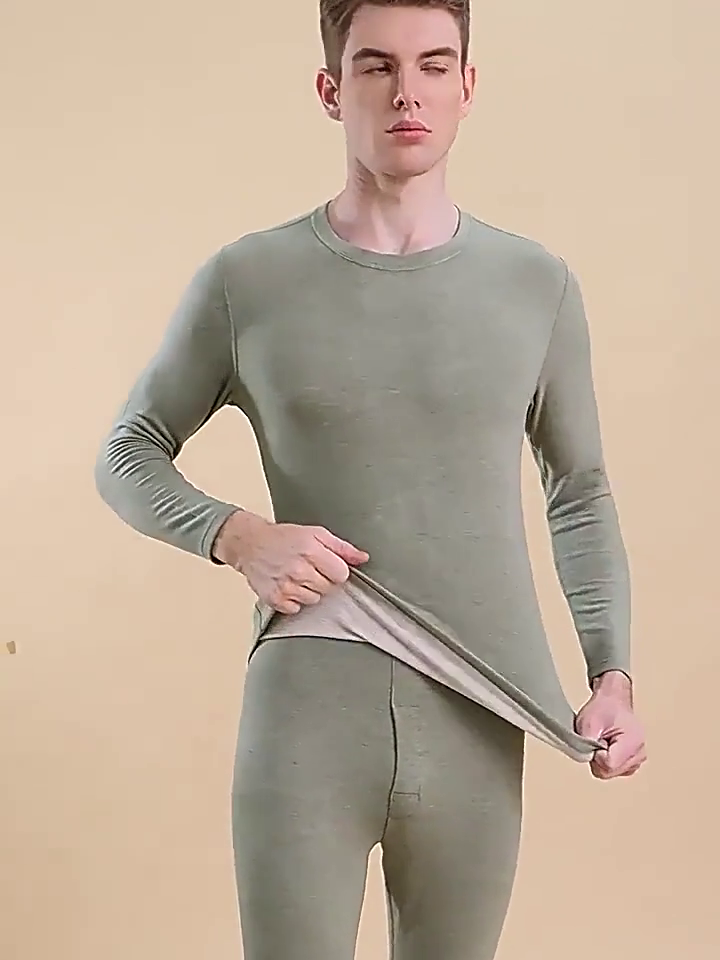
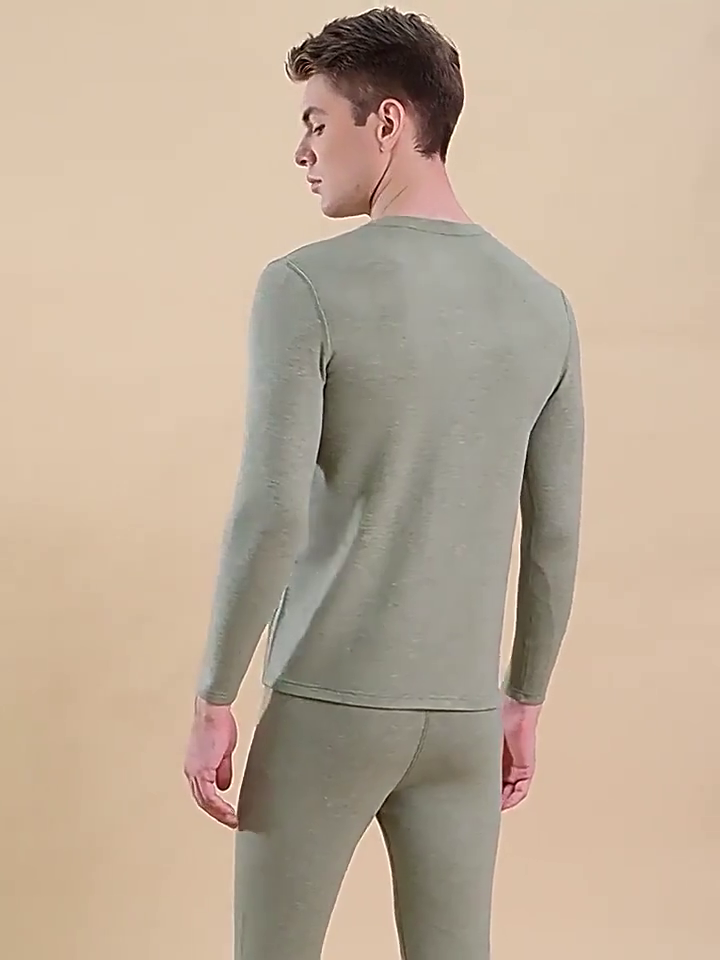
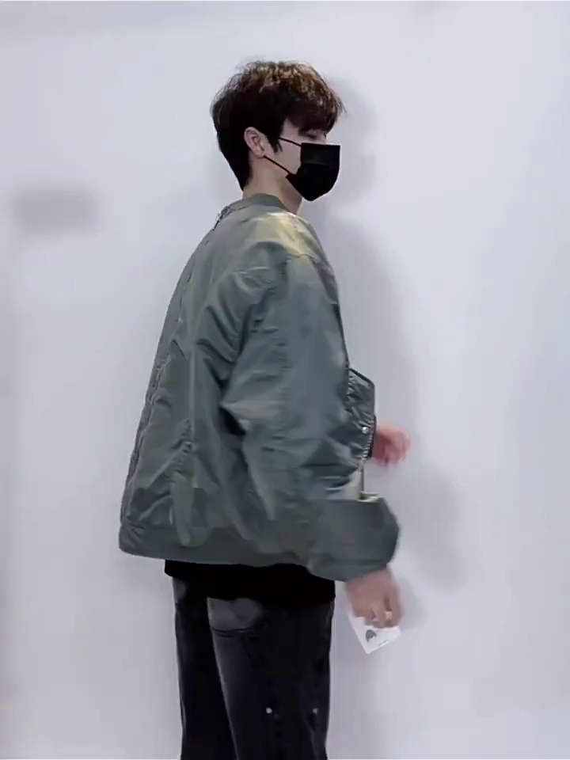
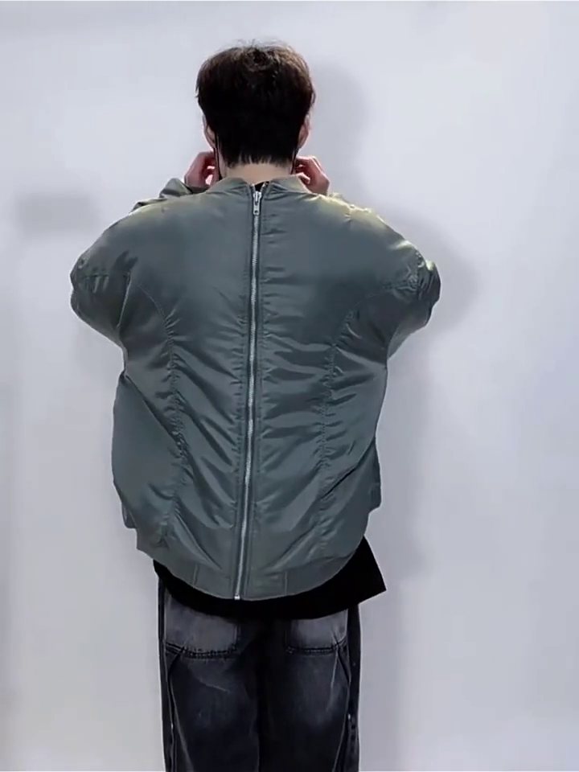
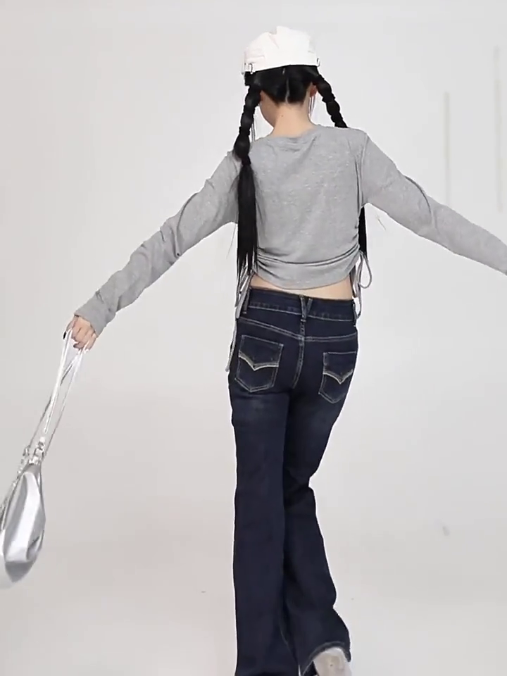
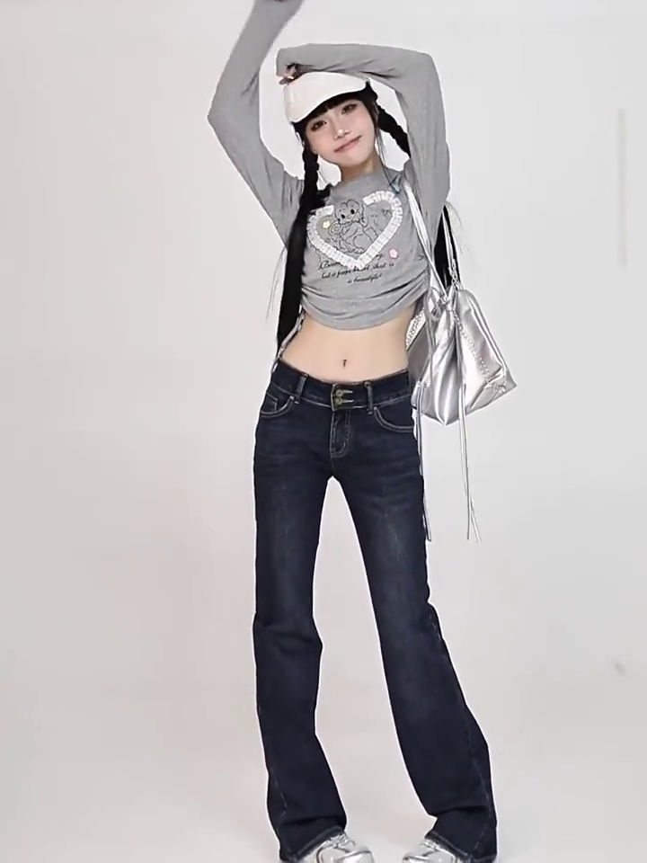
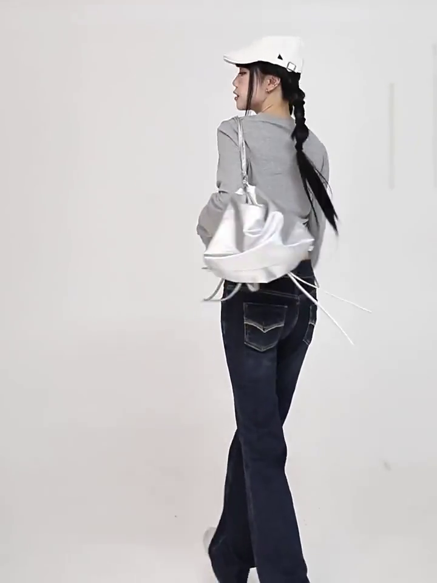
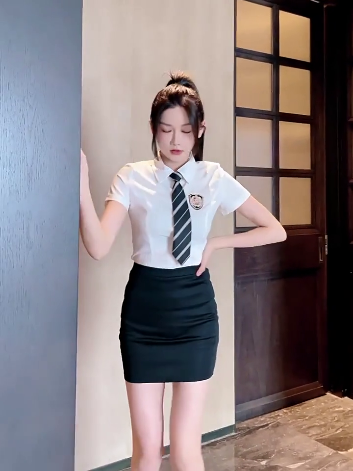
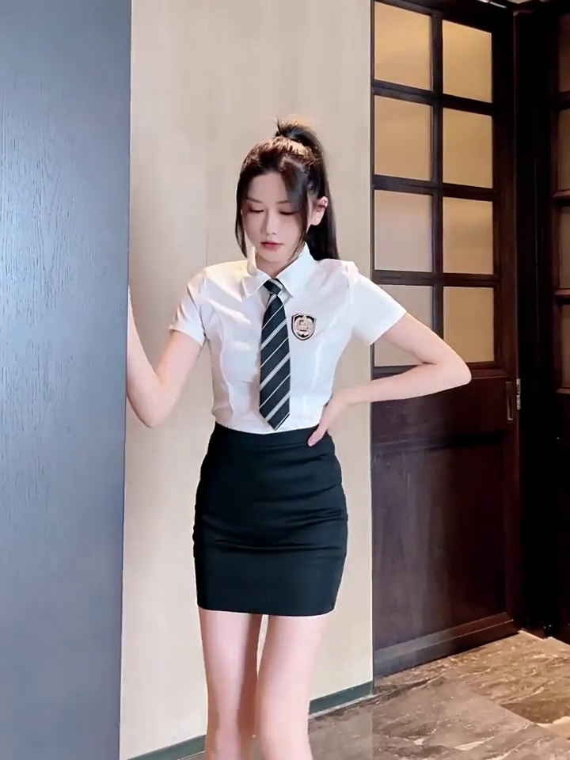
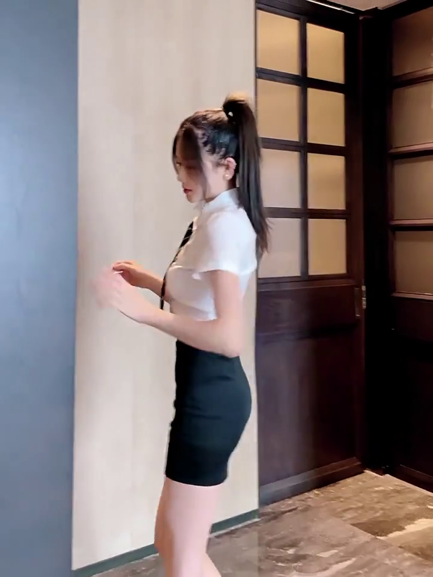

# Video Examples


| Text | Reference Images | Video |
| ---- | ---------------- | ------ |
| [Studio, Medium Close-Up, Medium Shot, Eye-Level, Static Shot, Pan Right, Tilt Down] The video begins with a medium close-up of a young, European-faced man with short brown hair, wearing a light olive green long-sleeved shirt. He is against a plain, light beige backdrop. He looks down at his left wrist, then looks up at the camera, adjusting the cuff of his shirt with both hands. He then turns slightly to his right, revealing the matching olive green long-sleeved shirt and pants he is wearing. He uses both hands to pull the shirt open at the waist, revealing a lighter, off-white inner layer. The lighting is bright and even, typical of a studio setting. The man's movements are deliberate and focused on showcasing the clothing. The camera remains static, initially focused on his upper body, then panning slightly to the right and tilting down to capture the full outfit. The scene transitions smoothly as the man adjusts his shirt and reveals the inner layer. The overall atmosphere is clean and minimalist, emphasizing the quality and fit of the clothing. The visual style is normal and product-focused. | <br> |  |
| [White Background Studio, Medium Shot, Eye-Level, Static Shot, Pan Right, Pan Left, Pan Right, Pan Left, Pan Right, Pan Left] Against a plain white backdrop, a young Asian man with short, dark hair models a large, olive-green bomber jacket. He wears a black face mask, a black t-shirt, and dark gray, slightly faded jeans. A white tag hangs from the jacket's zipper. Initially, he faces the camera, then turns his body to the right, showcasing the jacket's profile. He then turns back to face the camera, then turns to his right again, this time showing the back of the jacket. He turns back to face the camera, then turns to his right once more, revealing the back zipper of the jacket. He then turns back to face the camera, his hands at his sides. The lighting is bright and even, likely studio lighting. The scene is simple and focused on the clothing. The man's movements are deliberate and slow, allowing the viewer to clearly see the jacket's details. The video evokes a sense of showcasing a new garment. The overall style is simple and informative, typical of a clothing advertisement. | <br><br><br> |  |
| [White Studio Background, Medium Shot, Eye-Level, Static Shot] A young Asian woman with long black hair styled in two braids walks towards the camera against a plain white backdrop. She wears a white baseball cap, a gray long-sleeved crop top with a heart design, dark blue flared jeans, and silver sneakers. A silver metallic shoulder bag hangs from her left shoulder. Initially, she adjusts her cap with both hands, then lowers them and places her right hand on her hip. She looks directly at the camera and speaks, her mouth moving as she gestures with her hands. She then extends her arms out to the sides, raising them above her head. The lighting is bright and even, typical of a studio setting. The scene is simple and focused on the woman and her outfit. The overall style is casual and trendy, showcasing a specific fashion style. The video evokes a sense of confidence and style. The visual style is normal. | <br><br><br> |  |
| [Indoor, Medium Shot, Eye-Level, Static Shot] The video features a young Asian woman with long dark hair tied in a high ponytail, wearing a white short-sleeved collared shirt, a black and white striped tie, and a black mini skirt. She stands in a hallway with light beige walls and a dark wooden door with glass panels. The floor is a dark marble tile. The lighting is soft and diffused, likely from indoor lighting. Initially, she walks towards the left side of the frame, her right hand adjusting her shirt. She then stops, places her right hand on the wall, and shifts her weight to her left leg, her left hand resting on her hip. She looks down and to her right, then raises her left hand and waves it slightly. She then brings her left hand to her head, touching her hair. She crosses her arms across her chest, her left hand resting on her right arm. She looks directly at the camera with a serious expression. The scene remains static throughout, focusing on the woman's movements and poses. The overall atmosphere is stylish and confident. The video's visual style is normal. | <br><br><br> |  |
```
